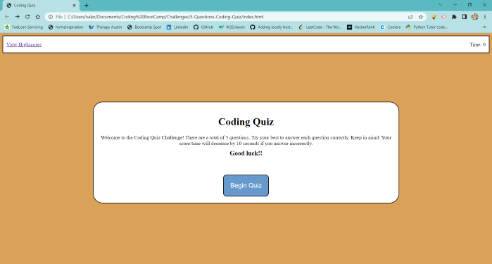
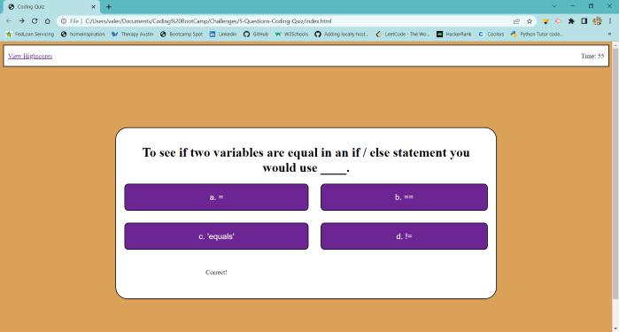
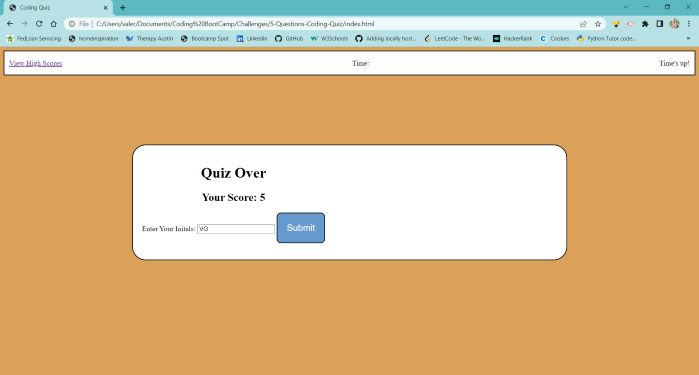
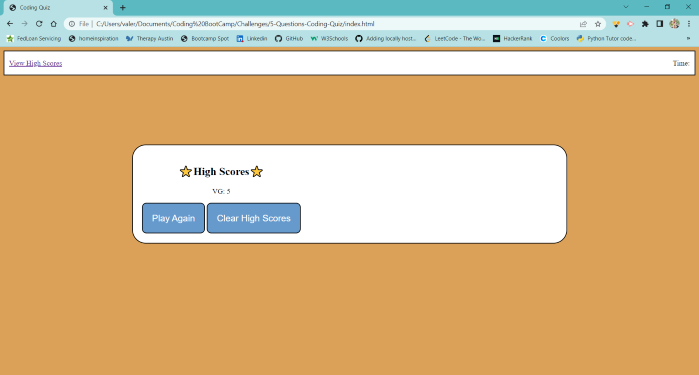

# Code Quiz

## Description
A quiz with 5 multiple choice questions, a timer, and high scores.

Quiz taker will read instructions on main page. When ready, quiz taker clicks on "Begin Quiz" button
and will display first question. Quiz taker has 60 seconds to complete the quiz.

When timer runs out or quiz taker has completed the quiz, score will display and quiz taker can save score
and initials. Quiz taker can also view high scores and clear.

## Built With:
◾ HTML
◾ CSS
◾ Javascript

## Website Screenshot

## Link to deployed application
<!-- update soon -->